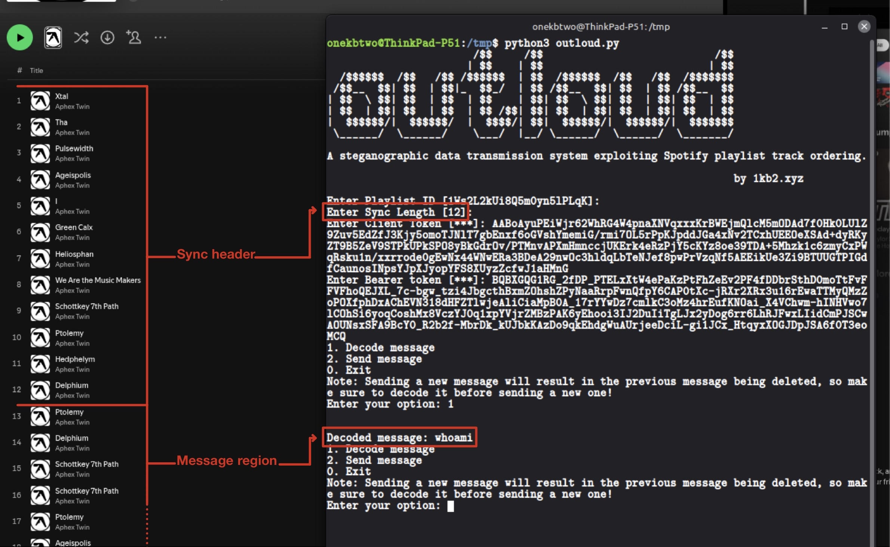
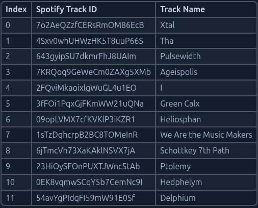

# OutLoud

A steganographic data transmission system exploiting Spotify playlist track ordering

---

**Contributors**

| Handle | Role                                |
| ------ | ----------------------------------- |
| - | - |
| - | - |
| - | - |

---

## 1.0 Abstract

### 1.1 Overview

Outloud is a Proof-of-Concept (PoC) covert channel that encodes arbitrary text 
messages into the ordering of tracks within a public Spotify playlist.

By exploiting the fact that Spotify embeds all playlist track URIs in publicly 
accessible HTML meta tags, a receiver requires no authentication whatsoever to 
decode messages. The sender encodes data using a `base-N positional encoding scheme`  where the first N tracks define a dynamic codebook, and subsequent tracks represent encoded characters.

The shared secret between sender and receiver is a single integer, the `sync length`, 
which determines both the codebook and the encoding base.

This paper documents the technical design, implementation, API reverse engineering 
findings, and detection considerations for this channel.

Follow this and additional works at: https://1kb2.xyz

---

### 1.2 What is a Covert Channel?

**Covert channels** [1] enable secret data transmission through legitimate system resources or protocols, evading detection by hiding communication within normal operations. They fall into:
* **Timing channels** [2], like inter-packet delays.
* **Storage channels** [3], like modifying packet headers or in our case exploiting Spotify playlist track ordering.

---

### 1.3 Why Spotify?

Spotify presents a uniquely attractive platform for covert channel implementation for several reasons. With over 761 million users [4], playlist activity is considered entirely normal behavior that generates no suspicion. Unlike email or messaging platforms, playlist modifications leave no obvious communication trail between two parties.

More critically, Spotify exposes all playlist track URIs in publicly accessible HTML meta tags:
```html
<SNIP>
<meta name="music:song" content="https://open.spotify.com/track/7o2AeQZzfCERsRmOM86EcB"/>
<meta name="music:song:track" content="1"/>
<meta name="music:song" content="https://open.spotify.com/track/4Sxv0whUHWzHK5T8uuP66S"/>
<meta name="music:song:track" content="2"/>
<SNIP>
```

intended for search engine indexing and social media link previews. This means a receiver can decode messages using nothing more than an HTTP request to a public playlist URL, no account, no API key, no authentication of any kind, for public playlists only.

Finally, Spotify's internal GraphQL API accepts write operations such as adding and removing tracks using session tokens extractable from any logged-in browser session, requiring no registered developer account or official API access.

---

## 2.0 Background

Steganography is the practice of concealing information within ordinary, non-secret data so that the existence of a message goes undetected [5]. 

While steganographic techniques have existed for centuries, the field only developed a formal theoretical foundation in the early 1990s with the rise of digital media and networked communication [5].

### 2.1 Steganography theory

Unlike cryptography, which protects the content of a message, steganography protects the fact that communication is occurring at all. 

Steganography is sometimes conflated with security through obscurity, the flawed principle that a system is secure simply because its inner workings are hidden. 

As Bruce Schneier noted: 

> "Security through obscurity is no security at all." [6]

This distinction is critical for Outloud. The channel itself provides no confidentiality if an adversary discovers the playlist and knows the sync length, they can decode any message trivially. For operational security, plaintext messages should be encrypted before encoding into the playlist. Outloud provides *covertness*, not *confidentiality*, these properties should not be conflated.


### 2.2 Existing covert channels 

Covert channels are classified into two fundamental categories: storage channels, which encode information in a persistent readable medium, and timing channels, which encode information in the timing of events [2]. 

Implementations vary widely. Common examples include:

**Network protocol channels** exploit the structure of network protocols to hide data. During the SolarWinds compromise (attributed to APT29/SVR), attackers used DNS subdomain encoding to construct randomized subdomains for C2 communication [7]. Similarly, the Ke3chang/APT15 group's Okrum backdoor employed custom HTTP header steganography using `Cookie` and `Set-Cookie` fields for C2 [8]. 

**Media steganography** hides data within innocent-looking files. 
- LSB image embedding conceals data in the least significant bits of pixel values in PNG and JPEG files [9]. 
- Echo audio steganography embeds data into audio signals by varying the amplitude, decay rate, and offset of introduced echoes [10]. 

**Web service abuse** (MITRE ATT&CK T1102 [11]) stores malicious payloads directly on legitimate platforms such as Dropbox, GitHub, or Pastebin. While these blend into normal traffic due to the legitimacy of the hosting platform, the payload itself remains detectable through content inspection.

Outloud differs fundamentally from all of the above, no malicious content is stored anywhere. The message exists only in the semantic ordering of tracks within a normal music playlist, invisible to any content-based detection.

### 2.3 Why social platforms are interesting targets

Social platforms are particularly interesting targets for covert channel implementation due to the sheer volume of traffic they generate. Connections to platforms like Spotify, Twitter, or Instagram blend seamlessly into baseline network noise, making individual requests statistically invisible to most monitoring tools unless it is excessive.

Outloud specifically leverages Spotify because the encoded data is functionally benign at rest (e.g. a playlist of Aphex Twin tracks raises no suspicion to any observer, human or automated, nor does it cause any harm to the platform or its users). The data only becomes meaningful when decoded with knowledge of the sync length, meaning content inspection alone is insufficient to detect the channel.

Unlike attacker-controlled C2 infrastructure, social platforms cannot be blocklisted without significant operational justification. An employee listening to music on Spotify while working is entirely expected behavior.

---

## 3.0 Technical Design

### 3.1 The Sync Header Concept

Outloud encodes messages into the ordering of tracks within a Spotify playlist. The playlist is divided into two regions:

- **Sync header**: the first N tracks, where N is the `SYNC_LENGTH`. These tracks define the codebook dynamically, their position in the playlist determines their symbol value. Track at position 1 = symbol 0, position 2 = symbol 1, and so on.
- **Message region**: all tracks after position N. These tracks encode the actual message using the codebook defined by the sync header.

The sync header serves two purposes. First it establishes the encoding alphabet without any hardcoded values, the codebook is derived entirely from the current state of the playlist. Second, reordering the sync header tracks produces a completely different codebook, effectively changing the encoding key without  modifying any software.

Below is an example playlist with `SYNC_LENGTH = 12`, and the resulting codebook  generated from its sync header:



*Figure 1: Playlist viewed in Spotify — first 12 tracks form the sync header, subsequent tracks encode the message.*




*Figure 2: Codebook generated from sync header of playlist `1Ws2L2kUi8Q5m0yn5lPLqK` with `SYNC_LENGTH = 12`*

### 3.2 Base-12 encoding

The encoding base is determined directly by the `SYNC_LENGTH` , the number of tracks in the sync header. With `SYNC_LENGTH = 12`, Outloud operates in base-12 by default.

The number of tracks required to represent a single ASCII character (values 0–127) is calculated as:

```

tracks_per_char = ⌈log_N(128)⌉

```

Where N is the base (equal to sync length) and 128 is the size of the ASCII  character space.

#### Why base-12?

Base-12 is the smallest base that achieves full ASCII coverage in exactly 2 tracks per character:

```

11² = 121 < 128 ✗ needs 3 tracks per character
12² = 144 ≥ 128 ✓ needs 2 tracks per character

```

This makes 12 the optimal choice, it minimizes the sync header size while keeping the encoding at 2 tracks per character.

#### **Example: encoding the letter `w` (ASCII 119) in base-12:**

Encoding:
```

119 ÷ 12 = 9 remainder 11

digits = [9, 11]

symbol 9 → Ptolemy (23HiOySFOnPUXTJWnc5tAb) 
symbol 11 → Delphium (54avYgPIdqFI59mW91E0Sf)

```

The letter `w` is encoded by appending Ptolemy followed by Delphium to the playlist after the sync header.

Decoding:
```

Read track → Ptolemy → symbol 9 
Read track → Delphium → symbol 11

value = (9 × 12) + 11 = 119

chr(119) = 'w' ✓

```

This is the first character of the message `whoami` currently encoded in the example playlist. 
See _Figure 1_ above.

**Comparison across different bases:**

| SYNC_LENGTH | Tracks per char | 5-char message | Max capacity* |
|-------------|-----------------|----------------|---------------|
| 4           | 4               | 20 tracks      | ~2,499 chars  |
| 8           | 3               | 15 tracks      | ~3,330 chars  |
| 12          | 2               | 10 tracks      | ~4,994 chars  |
| 16          | 2               | 10 tracks      | ~4,992 chars  |
| 32          | 2               | 10 tracks      | ~4,984 chars  |
| 64          | 2               | 10 tracks      | ~4,968 chars  |
| 128         | 1               | 5 tracks       | ~9,872 chars  |

*\*Based on Spotify's 10,000 track playlist limit, minus sync header tracks.* [12]


**Limitations:**

- **ASCII only:** the current implementation supports standard ASCII (0–127).  Extended character sets such as UTF-8 would require either a larger base or  more tracks per character.
- **Playlist size cap:** Spotify limits playlists to 10,000 tracks [12], giving  a theoretical maximum message length of ~4,994 characters at base-12.

> Note: In the current PoC, all sync header tracks are sourced from a single album (Aphex Twin — Selected Ambient Works 85-92) for simplicity. In an operational deployment, tracks would be sourced from multiple artists and genres to better  resemble a genuine user-curated playlist.

### 3.3 SYNC_LENGTH as shared secret

The only value both sender and receiver must agree on in advance is the `SYNC_LENGTH` , a single integer that determines where the sync header ends and the message region begins.

Without knowledge of the sync length, an observer cannot:

- Determine which tracks form the codebook and which encode the message
- Derive the encoding base
- Calculate how many tracks represent a single character

This makes the sync length function as a lightweight shared secret. While it does not provide cryptographic security, it introduces a layer of ambiguity, an interceptor who discovers the playlist must still guess or brute-force the correct sync length to decode anything meaningful.

**Keyspace analysis:**

For a playlist of T total tracks, an interceptor must try every possible `SYNC_LENGTH` from 2 to T-1. Most incorrect values will either produce decoding errors, where message tracks are not found in the codebook, or nonsensical output, making manual verification necessary for each attempt.

Additionally, the ordering of tracks within the sync header itself acts as a secondary key. With `SYNC_LENGTH = 12`, there are:

```

12! = 479,001,600 possible codebook permutations

```

>Note: Reordering the same 12 tracks in the sync header produces a completely different codebook without changing the track selection, effectively rekeying the channel by simply rearranging the playlist.

---

## 4.0 Implementation

### 4.1 Receiver: zero-auth HTML meta tag scraping
### 4.2 Sender: internal GraphQL API reverse engineering
### 4.3 Human sleep intervals for evasion

---

## 5.0 Findings

### 5.1 Spotify embeds all track URIs in public HTML
### 5.2 client-token is not account-bound
### 5.3 Bearer token required for writes only
### 5.4 No rate limiting observed during testing

---

## 6.0 Detection, Mitigation & Expansion

### 6.1 Blue Team Perspective

- What does Outloud traffic look like from a defender's point of view
- Does it appear in proxy/firewall logs
- Is the playlist fetch distinguishable from normal Spotify usage
- What artifacts does the sender leave behind

### 6.2 What Would Trigger a SIEM

- Behavioral indicators — repeated playlist fetches at regular intervals
- Volume anomalies — unusually frequent calls to open.spotify.com
- Process anomalies — non-browser processes making requests to Spotify
- Correlation rules that could catch the pattern
- Why most SIEMs would miss this entirely

### 6.3 How Spotify Could Detect/Prevent This

- Rate limiting track additions per session
- Anomaly detection on playlist modification frequency
- Flagging playlists where tracks are added and removed in rapid succession
- Whether Open Graph meta tags could be gated behind auth

### 6.4 Red Team Expansion

- Using Outloud as a dead drop for operator instructions
- Fileless persistence integration
- Polling loop implementation for autonomous receiver
- Operational security considerations
- Detection evasion beyond human sleep intervals

---

## 7.0 Conclusion

---

## References

[1] Taylor & Francis _Knowledge Hub Page on Covert Channels_, https://taylorandfrancis.com/knowledge/Engineering_and_technology/Computer_science/Covert_channels/

[2] Wray, J. C. (1991). "An Analysis of Covert Timing Channels." _Proceedings of the IEEE Symposium on Research in Security and Privacy_, 313–323. Oakland, CA, https://www.cs.cornell.edu/people/vickyw/iFlow/papers/wra91.pdf

[3] Lampson, B. W. (1973). "A Note on the Confinement Problem." _Communications of the ACM_, 16(10), 613–615, https://doi.org/10.1145/362375.362389

[4] Spotify, "Company Info", https://newsroom.spotify.com/company-info/

[5] Fridrich, J. (2009). _Steganography in Digital Media: Principles, Algorithms, and Applications. Cambridge University Press_, https://books.google.it/books?id=wcAZ-QEthqkC&printsec=frontcover#v=onepage&q&f=false

[6] Schneier, B. (2000). _Secrets and Lies: Digital Security in a Networked World. Wiley. page 344_, https://archive.org/details/secretsliesdigit0000schn/

[7] Zenarmor. (2023). _Detecting DNS tunneling attacks_, https://www.zenarmor.com/docs/network-security-tutorials/what-is-dns-tunneling

[8] Hromcová, Z. (2019). _Okrum and Ketrican: An overview of recent Ke3chang group activity_ . ESET Research, https://web-assets.esetstatic.com/wls/2019/07/ESET_Okrum_and_Ketrican.pdf

[9] Keshwani, P., Priyanka, R., & Nayak, L. (2018). _A Comprehensive Study of Various Techniques of Steganography: A Survey_, https://www.ijariit.com/conference-proceedings/28%20CSE%20120.pdf

[10] Negrat, A. M., & Kumar, A. (2010). _Secure Steganography for Audio Signals_, https://www.wseas.us/e-library/conferences/2010/Taipei/ISCGAV/ISCGAV-01.pdf

[11] MITRE ATT&CK (T1102), https://attack.mitre.org/techniques/T1102/

[12] Spotify Community, "Increase Playlist Limit to more than 10,000 songs", https://community.spotify.com/t5/Your-Library/Increase-Playlist-Limit-to-more-than-10-000-songs-please/m-p/5212545#M13836
